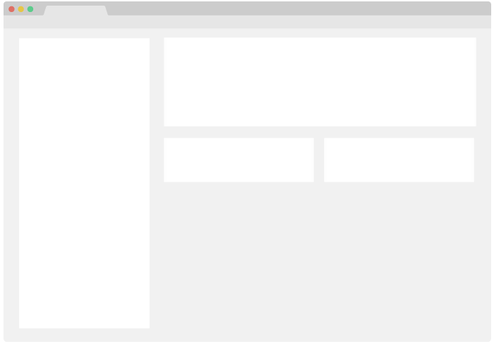

<!-- TOP ROW OF BADGES -->

[![Contributors][contributors-shield]][contributors-url]
[![Forks][forks-shield]][forks-url]
[![Stargazers][stars-shield]][stars-url]
[![Issues][issues-shield]][issues-url]
[![MIT License][license-shield]][license-url]
[![Kofi][kofi-badge]][kofi-url]

<a name="readme-top"></a>

<!-- PROJECT LOGO -->
<br />
<div align="center">
  <a href="https://github.com/smcnab1/super-bassoon">
    
  </a>

<h3 align="center">ModuMate</h3>

  <p align="center">
    A comprehensive web suite of tools to generate LMS Templates. 🎓📅
    <br />
    <a href="https://smcnab1.github.io/super-bassoon/"><strong>View Live Demo »</strong></a>
    <br />
    <br />
    <a href="https://github.com/smcnab1/super-bassoon">View Source</a>
    ·
    <a href="https://github.com/smcnab1/super-bassoon/issues">Report Bug</a>
    ·
    <a href="https://github.com/smcnab1/super-bassoon/issues">Request Feature</a>
  </p>
</div>

<details>
  <summary>📋 Table of Contents</summary>

<!-- toc -->

- [About The Project](#about-the-project)
  - [Features](#features)
  - [Built With](#built-with)
- [Getting Started](#getting-started)
  - [Prerequisites](#prerequisites)
  - [Installation](#installation)
  - [Usage](#usage)
- [Features Overview](#features-overview)
  - [Timetable Generation](#timetable-generation)
  - [Preset Management](#preset-management)
  - [Export Options](#export-options)
  - [Accessibility](#accessibility)
- [Technical Details](#technical-details)
  - [Architecture](#architecture)
  - [Data Structure](#data-structure)
  - [Browser Support](#browser-support)
- [Contributing](#contributing)
- [License](#license)

<!-- tocstop -->
  
</details>

<!-- ABOUT THE PROJECT -->
## About The Project

<div align="center">
  <a href="https://github.com/smcnab1/super-bassoon">
    
  </a>
</div>

ModuMate LMS Template Generator is a modern, accessible web application designed specifically for managing and generating LMS HTML Templates. It provides an intuitive interface for creating, editing, and exporting timetables with support for multiple cohorts, various export formats, and comprehensive accessibility features.

### Key Features

- **🎯 Timetable Generation**: Create and manage timetables with drag-and-drop functionality
- **📄 Preset Management**: Save and load timetable presets with cohort support (April/September)
- **📅 Multiple Export Formats**: Export to PDF, HTML, and iCalendar (.ics) formats
- **🌙 Dark/Light Theme**: Toggle between themes with persistent preferences
- **♿ Accessibility**: WCAG 2.1 AA compliant with screen reader support
- **📱 Responsive Design**: Works seamlessly on desktop, tablet, and mobile devices
- **🔄 Real-time Preview**: Live preview of timetable changes
- **📊 Week Management**: Add, remove, and reorder weeks with different types (Teaching, Reading, Assessment, Break)

### Built With

- **HTML5** - Semantic markup with accessibility features
- **CSS3** - Modern styling with CSS custom properties and responsive design
- **JavaScript (ES6+)** - Vanilla JavaScript with modern features
- **Font Awesome** - Icon library for consistent UI elements
- **jsPDF** - PDF generation library
- **Local Storage** - Client-side data persistence

<p align="right">(<a href="#readme-top">back to top</a>)</p>

## Getting Started

### Prerequisites

- Modern web browser (Chrome 80+, Firefox 75+, Safari 13+, Edge 80+)
- No additional software installation required
- Works offline after initial load

### Installation

1. Clone the repository
   ```bash
   git clone https://github.com/smcnab1/super-bassoon.git
   cd super-bassoon
   ```

2. Open `index.html` in your web browser
   ```bash
   # On macOS/Linux
   open index.html
   
   # On Windows
   start index.html
   ```

3. Or serve with a local server (recommended)
   ```bash
   # Using Python 3
   python -m http.server 8000
   
   # Using Node.js
   npx serve .
   
   # Using PHP
   php -S localhost:8000
   ```

### Usage

1. **Generate Timetable**: Click "📅 Timetable" to start creating a new timetable
2. **Load Preset**: Choose from available module presets or import custom JSON
3. **Customize**: Add weeks, set dates, and configure module details
4. **Preview**: Use the preview feature to see how your timetable looks
5. **Export**: Download as PDF, copy HTML, or export to calendar format

<p align="right">(<a href="#readme-top">back to top</a>)</p>

## Features Overview

### Timetable Generation

#### Core Functionality
- **Week Management**: Add, remove, and reorder weeks dynamically
- **Week Types**: Support for Teaching, Reading, Assessment, and Break weeks
- **Date Calculation**: Automatic date calculation based on first teaching date
- **Highlighting**: Mark important weeks with highlighting feature
- **Real-time Updates**: Changes reflect immediately in the preview

#### Week Types & Styling
- **Teaching Weeks**: Blue styling with comprehensive content areas
- **Reading Weeks**: Orange styling for self-study periods
- **Assessment Weeks**: Red styling for evaluation periods
- **Break Weeks**: Purple styling for holidays and breaks

#### Module Information
- **Module Details**: Display module name, code, year, and leader
- **Cohort Support**: Separate data for April and September cohorts
- **Tutor Management**: Add and manage multiple tutors per module
- **Location Tracking**: Record and display teaching locations

### Preset Management

#### Custom Presets
- **JSON Import/Export**: Full preset data import and export
- **File Upload**: Drag-and-drop or file selection for JSON files
- **Validation**: Automatic validation of JSON structure
- **Backup**: Local storage backup of custom presets

#### Cohort Support
- **Dual Cohorts**: Separate data for April and September intakes
- **Date Differences**: Automatic handling of different academic calendars
- **Cohort Selection**: Modal-based cohort selection when loading presets
- **Export Integration**: Cohort information included in all exports

### Export Options

#### PDF Export
- **Professional Layout**: Clean, print-ready PDF format
- **Module Information**: Complete module details and cohort information
- **Week Details**: All week information with proper formatting
- **Color Coding**: Maintains week type color coding in PDF
- **Custom Styling**: Optimized for both screen and print viewing

#### HTML Export
- **Full HTML**: Complete HTML markup for external use
- **Copy to Clipboard**: One-click copying of generated HTML
- **Styling Included**: All CSS styles embedded in the HTML
- **Responsive**: Maintains responsive design in exported HTML

#### Calendar Export (.ics)
- **iCalendar Format**: Standard calendar format compatible with all major calendar apps
- **Event Details**: Each week as a calendar event with full details
- **Time Slots**: Default 09:00-17:00 time slots for each week
- **Color Coding**: Different colors for different week types
- **Import Instructions**: Modal with step-by-step import instructions for:
  - Microsoft Outlook
  - Google Calendar
  - Apple Calendar
  - Other calendar applications

### Accessibility

#### WCAG 2.1 AA Compliance
- **Keyboard Navigation**: Full keyboard accessibility
- **Screen Reader Support**: Proper ARIA labels and semantic markup
- **Focus Management**: Clear focus indicators and logical tab order
- **Color Contrast**: High contrast ratios for all text elements
- **Skip Links**: Skip to main content functionality

#### Assistive Technology Support
- **Screen Readers**: Compatible with NVDA, JAWS, VoiceOver, and TalkBack
- **High Contrast Mode**: Automatic adaptation to system high contrast settings
- **Reduced Motion**: Respects user's motion preferences
- **Font Scaling**: Supports browser font scaling up to 200%

#### Semantic HTML
- **Proper Headings**: Logical heading hierarchy (h1-h3)
- **Landmark Roles**: Navigation, main, and content landmarks
- **Form Labels**: All form elements properly labeled
- **Button Descriptions**: Descriptive button text and ARIA labels

<p align="right">(<a href="#readme-top">back to top</a>)</p>

## Technical Details

### Architecture

#### File Structure
```
super-bassoon/
├── index.html                 # Main landing page
├── styles.css                 # Comprehensive CSS with theming
├── timetable/
│   ├── generate.html          # Main timetable generator
│   ├── presets.json          # Built-in preset data
│   └── preset/
│       ├── new.html          # Create new presets
│       └── edit.html         # Edit existing presets
├── images/                   # Project images and screenshots
├── README.md                 # This file
├── CHANGELOG.md             # Version history
└── LICENSE.md               # MIT License
```

#### Data Structure
```json
{
  "ED70011X": {
    "april": {
      "name": "Foundations of Simulation Education",
      "code": "ED70011X",
      "year": "Year 1",
      "leader": "Dr. Example",
      "tutors": ["Tutor 1", "Tutor 2"],
      "weeks": [
        {
          "week": 1,
          "topic": "Introduction to Simulation",
          "type": "teaching",
          "date": "2024-04-15",
          "location": "Room 101",
          "highlight": false
        }
      ]
    },
    "september": {
      // Similar structure for September cohort
    }
  }
}
```

#### CSS Architecture
- **CSS Custom Properties**: Theme variables for consistent styling
- **Dark/Light Themes**: Complete theme system with smooth transitions
- **Responsive Design**: Mobile-first approach with breakpoints
- **Accessibility**: Focus states, high contrast, and reduced motion support
- **Print Styles**: Optimized CSS for PDF generation

#### JavaScript Features
- **ES6+ Syntax**: Modern JavaScript with arrow functions, destructuring, etc.
- **Local Storage**: Persistent data storage for user preferences
- **Event Handling**: Comprehensive event management
- **PDF Generation**: Client-side PDF creation with jsPDF
- **Calendar Export**: iCalendar format generation
- **Form Validation**: Real-time validation and error handling

### Browser Support

#### Supported Browsers
- **Chrome**: 80+ (Full support)
- **Firefox**: 75+ (Full support)
- **Safari**: 13+ (Full support)
- **Edge**: 80+ (Full support)

#### Required Features
- **CSS Custom Properties**: For theming system
- **ES6 Modules**: For modern JavaScript features
- **Local Storage**: For data persistence
- **File API**: For JSON import functionality
- **Blob API**: For file downloads

#### Progressive Enhancement
- **Graceful Degradation**: Core functionality works without JavaScript
- **Feature Detection**: Automatic fallbacks for unsupported features
- **Polyfills**: Minimal polyfills for older browsers

<p align="right">(<a href="#readme-top">back to top</a>)</p>

## Contributing

Contributions are what make the open source community such an amazing place to learn, inspire, and create. Any contributions you make are **greatly appreciated**.

### How to Contribute

1. **Fork the Project**
2. **Create your Feature Branch** (`git checkout -b feature/AmazingFeature`)
3. **Commit your Changes** (`git commit -m 'Add some AmazingFeature'`)
4. **Push to the Branch** (`git push origin feature/AmazingFeature`)
5. **Open a Pull Request**

### Development Guidelines

#### Code Style
- **HTML**: Semantic markup with proper accessibility attributes
- **CSS**: Use CSS custom properties, follow BEM methodology
- **JavaScript**: ES6+ syntax, meaningful variable names, proper error handling

#### Accessibility Requirements
- All new features must be keyboard accessible
- Screen reader compatibility required
- Maintain WCAG 2.1 AA compliance
- Test with assistive technologies

#### Testing Checklist
- [ ] Test on multiple browsers (Chrome, Firefox, Safari, Edge)
- [ ] Test responsive design on mobile devices
- [ ] Verify keyboard navigation
- [ ] Test with screen reader
- [ ] Check color contrast ratios
- [ ] Validate HTML markup

### Reporting Issues

When reporting issues, please include:
- **Browser and version**
- **Operating system**
- **Steps to reproduce**
- **Expected vs actual behavior**
- **Screenshots if applicable**

<p align="right">(<a href="#readme-top">back to top</a>)</p>

## License

This project is licensed under the [MIT License](LICENSE.md) - see the [LICENSE.md](LICENSE.md) file for details.

The MIT License allows for:
- ✅ Commercial use
- ✅ Modification
- ✅ Distribution
- ✅ Private use
- ❌ No liability
- ❌ No warranty

<p align="right">(<a href="#readme-top">back to top</a>)</p>

<!-- MARKDOWN LINKS & IMAGES -->

[contributors-shield]: https://img.shields.io/github/contributors/smcnab1/super-bassoon.svg?style=for-the-badge
[contributors-url]: https://github.com/smcnab1/super-bassoon/graphs/contributors
[forks-shield]: https://img.shields.io/github/forks/smcnab1/super-bassoon.svg?style=for-the-badge
[forks-url]: https://github.com/smcnab1/super-bassoon/network/members
[stars-shield]: https://img.shields.io/github/stars/smcnab1/super-bassoon.svg?style=for-the-badge
[stars-url]: https://github.com/smcnab1/super-bassoon/stargazers
[issues-shield]: https://img.shields.io/github/issues/smcnab1/super-bassoon.svg?style=for-the-badge
[issues-url]: https://github.com/smcnab1/super-bassoon/issues
[license-shield]: https://img.shields.io/github/license/smcnab1/super-bassoon.svg?style=for-the-badge
[license-url]: https://github.com/smcnab1/super-bassoon/blob/master/LICENSE.md
[linkedin-shield]: https://img.shields.io/badge/-LinkedIn-black.svg?style=for-the-badge&logo=linkedin&colorB=555
[linkedin-url]: https://www.linkedin.com/in/sammcnab/
[product-screenshot]: images/screenshot.png
[email-badge]: https://img.shields.io/badge/Email-D14836?style=for-the-badge&logo=gmail&logoColor=white
[email-url]: mailto:sam@sammcnab.co.uk
[git-badge]: https://img.shields.io/badge/GitHub-100000?style=for-the-badge&logo=github&logoColor=white
[git-url]: https://github.com/smcnab1
[kofi-badge]: https://ko-fi.com/img/githubbutton_sm.svg
[kofi-url]: https://ko-fi.com/sammcnab1
